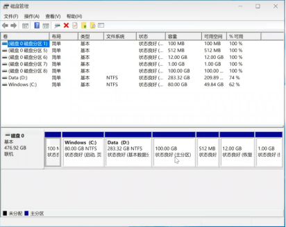
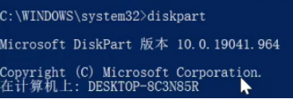
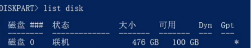
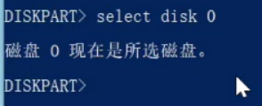
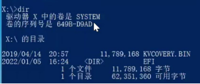
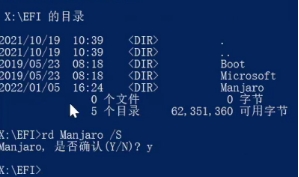
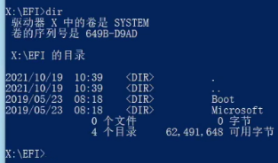

# Windows系统下卸载双系统linux
### 1 Windows开始界面搜索磁盘管理，删除未确定分区

### 2 windows使用管理员身份运行cmd进入终端
### 3 在磁盘中找到linux系统
3.1 进入diskpart目录
```bash
diskpart
```

3.2 产看当前磁盘
```bash
list disk
```

3.3 选中磁盘0
```bash
select disk 0
```

3.4 查看当前磁盘分区
```bash
list partition
```


3.5 进入系统分区1
```bash
select partition 1
```


3.6 为了随时访问分区验证是否删除，需要额为分区分配盘名才能访问
```bash
assign letter=x
```

3.7推出diskpart
```powershell
exit
```
### 4 在磁盘系统中删除linux系统
4.1 进入刚才命名的分区,输入x
```bash
x
```

4.2 查看当前分区目录，没有 assign letter=x 会无法访问
```bash
dir
```

4.3 进入EFI目录
```bash
cd efi
```

4.4 删除, 除了Microsoft的系统, 输入y, 删除成功
```powershell
rd Manjaro /S
```
如果是ubuntu就将Manjaro改成ubuntu即可 
```powershell
rd ubuntu /S
```

4.5 验证系统是否删除完全
```bash
dir
```

除了Microsoft 没有其他系统，证明linux系统成功删除


