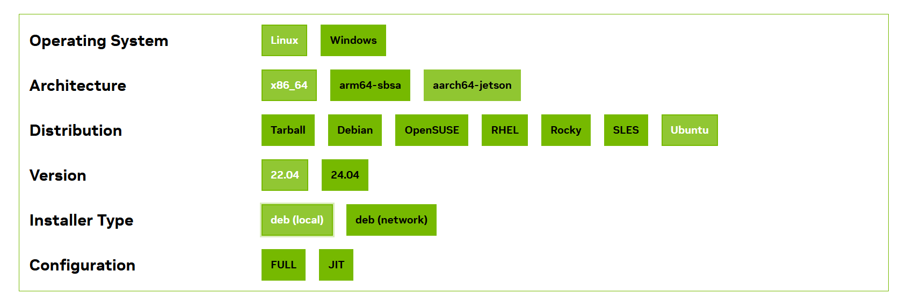
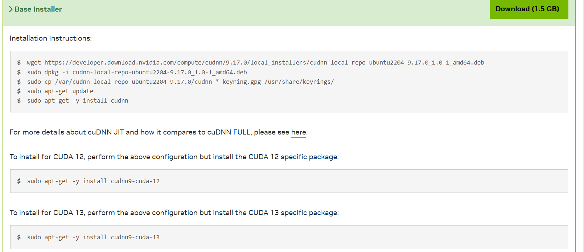

# 安装支持CUDA加速的Opencv

### 1 配置ffmepg
1.1 因为我要在opencv中配置ffmpeg, 所以先配置好ffmpeg
```bash
sudo apt-install ffmpeg
```
1.2 安装必要的库
```bash
sudo apt-get update
sudo apt-get install build-essential
sudo apt-get install cmake git libgtk2.0-dev pkg-config libavcodec-dev libavformat-dev libswscale-dev
sudo apt-get install python-dev python-numpy libtbb2 libtbb-dev libjpeg-dev libpng-dev libtiff-dev libjasper-dev libdc1394-22-dev
sudo apt-get install cmake git libgtk2.0-dev pkg-config libavcodec-dev libavformat-dev libswscale-dev
```

### 2 安装Cmake
2.1 安装
```bash
sudo apt-get install cmake
```

2.2 安装其他依赖项
```bash
sudo apt-get install build-essential libgtk2.0-dev libavcodec-dev libavformat-dev \
libjpeg-dev libswscale-dev libtiff5-dev libgtk2.0-dev pkg-config
```

### 3 安装OpenCV，opencv-contrib, GPU驱动
3.1 下载opencv以及opencv-contrib
```bash
git clone https://github.com/opencv/opencv.git
git clone https://github.com/opencv/opencv_contrib.git
```

3.2 安装英伟达驱动，其实我认为不需要安装，因为wsl和windows是共用GPU，但是可以创建NVIDIA文件夹将cuda，cuDNN和Tenssort放进去
```bash
cd ~
mkdir NVIDIA && cd NVIDIA
sudo chmod +x *.run
sudo chmod +x *.deb
sudo ./NVIDIA-Linux-x86_64-550.54.14.run
```

3.3 检查驱动
```bash
nvidia-smi
```


### 4 安装cuda
4.1 浏览器搜索cuda，找到对应的版本按照官方的方式安装即可


```bash
wget https://developer.download.nvidia.com/compute/cuda/repos/wsl-ubuntu/x86_64/cuda-wsl-ubuntu.pin
sudo mv cuda-wsl-ubuntu.pin /etc/apt/preferences.d/cuda-repository-pin-600
wget https://developer.download.nvidia.com/compute/cuda/13.0.2/local_installers/cuda-repo-wsl-ubuntu-13-0-local_13.0.2-1_amd64.deb
sudo dpkg -i cuda-repo-wsl-ubuntu-13-0-local_13.0.2-1_amd64.deb
sudo cp /var/cuda-repo-wsl-ubuntu-13-0-local/cuda-*-keyring.gpg /usr/share/keyrings/
sudo apt-get update
sudo apt-get -y install cuda-toolkit-13-0
```

4.2 建立连接确定
```bash
vim ~/.bashrc
```
在末尾添加：
```bash
export LD_LIBRARY_PATH=/usr/local/cuda/lib64
export PATH=$PATH:/usr/local/cuda/bin
```
刷新环境变量
```bash
source ~/.bashrc      
```
查看版本信息
```bash
nvcc -V
```

### 5 安装CuDNN
也是选择对应的版本


```bash
wget https://developer.download.nvidia.com/compute/cudnn/9.17.0/local_installers/cudnn-local-repo-ubuntu2204-9.17.0_1.0-1_amd64.deb
sudo dpkg -i cudnn-local-repo-ubuntu2204-9.17.0_1.0-1_amd64.deb
sudo cp /var/cudnn-local-repo-ubuntu2204-9.17.0/cudnn-*-keyring.gpg /usr/share/keyrings/
sudo apt-get update
sudo apt-get -y install cudnn
sudo apt-get -y install cudnn9-cuda-12
sudo apt-get -y install cudnn9-cuda-13
```

### 6 安装Tensorrt
```bash
cd ~/NVIDIA # 回到NVIDIA路径下
sudo dpkg -i nv-tensorrt-local-repo-ubuntu2204-8.5.3-cuda-11.8_1.0-1_amd64.deb
sudo cp /var/nv-tensorrt-local-repo-ubuntu2204-8.5.3-cuda-11.8/*-keyring.gpg /usr/share/keyrings/ # 最好直接复制终端提示
sudo apt-get update
sudo apt-get install tensorrt
```
验证安装
```bash
dpkg -l | grep TensorRT
```

### 7 安装Opencv库(选择性安装)
7.1 通用工具：
```bash
sudo apt install build-essential cmake pkg-config unzip yasm git checkinstall
```
7.2 图像I/O库：
```bash
sudo apt install libjpeg-dev libpng-dev libtiff-dev
```
7.3 视频/音频库 - FFMPEG、GSTREAMER、x264 等：
```bash
sudo apt install libavcodec-dev libavformat-dev libswscale-dev libavresample-dev
sudo apt install libgstreamer1.0-dev libgstreamer-plugins-base1.0-dev
sudo apt install libxvidcore-dev x264 libx264-dev libfaac-dev libmp3lame-dev libtheora-dev
sudo apt install libfaac-dev libmp3lame-dev libvorbis-dev
```
7.4 OpenCore - 自适应多速率窄带 (AMRNB) 和宽带 (AMRWB) 语音编解码器：
```bash
sudo apt install libopencore-amrnb-dev libopencore-amrwb-dev
```
7.5 CPU 并行库 C++ ：
```bash
sudo apt-get install libatlas-base-dev gfortran
```

### 8 配置Opencv
8.1 进入opencv目录，创建一个build文件夹并进入
```bash
mkdir build && cd build
```

8.2 进行cmake
```bash
cmake -D CMAKE_BUILD_TYPE=RELEASE \
      -D CMAKE_INSTALL_PREFIX=/usr/local \
      -D WITH_CUDA=ON \
      -D WITH_CUDNN=ON \
      -D WITH_CUBLAS=1 \
      -D ENABLE_FAST_MATH=1 \ 
      -D CUDA_FAST_MATH=1 \
      -D CUDA_ARCH_BIN=8.9 \ #按照自己电脑的GPU更改
      -D WITH_FFMPEG=ON \
      -D OPENCV_GENERATE_PKGCONFIG=ON \
      -D OPENCV_PC_FILE_NAME=opencv.pc \
      -D OPENCV_ENABLE_NONFREE=ON \
      -D OPENCV_EXTRA_MODULES_PATH=../../opencv_contrib/modules \
      -D BUILD_opencv_python3=ON \
      #根据自己的python环境进行配置
      -D PYTHON3_EXECUTABLE=/root/miniconda3/envs/wsl_py3.12/bin/python \
      -D PYTHON3_INCLUDE_DIR=/root/miniconda3/envs/wsl_py3.12/include/python3.12 \
      -D PYTHON3_LIBRARY=/root/miniconda3/envs/wsl_py3.12/lib/libpython3.12.so \
      -D PYTHON3_PACKAGES_PATH=/root/miniconda3/envs/wsl_py3.12/lib/python3.12/site-packages \
      ..
```
出现这个编译成功

cmake之后进行make编译
```bash
sudo make -j8
```
完成之后再进行安装
```bash
sudo make install
```
8.3 配置环境
```bash
sudo vim /etc/ld.so.conf
```
在里面加上一行/usr/local/lib,这个是opencv的安装路径
```bash
include /etc/ld.so.conf.d/*.conf
/usr/local/lib
```
运行
```bash
sudo ldconfig
```
然后修改bash.bashrc文件
```bash
sudo vim /etc/bash.bashrc
```
在结尾加入
```bash
PKG_CONFIG_PATH=$PKG_CONFIG_PATH:/usr/local/lib/pkgconfig
export PKG_CONFIG_PATH
```
然后进行source
```bash
source /etc/bash.bashrc
```
检验安装
用 **pkg-config --modversion opencv4** 或者 **pkg-config --modversion opencv** 检测OPenCV4或OPenCV的安装版本。
```bash
pkg-config --modversion opencv
```
显示opencv版本号表示安装成功


