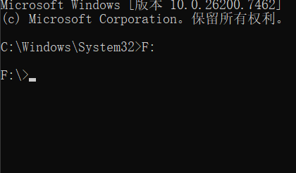
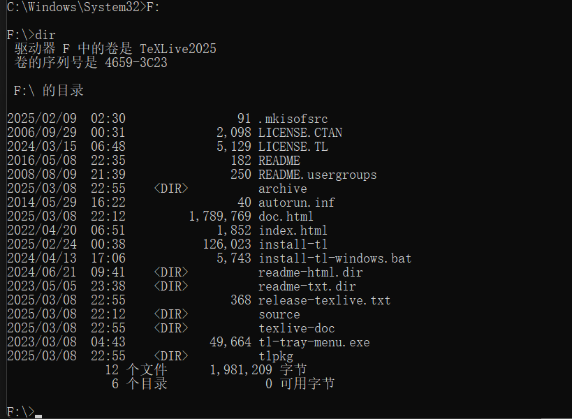
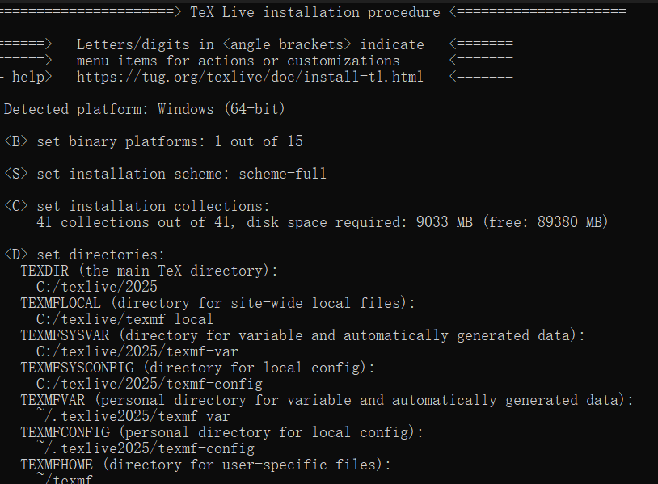
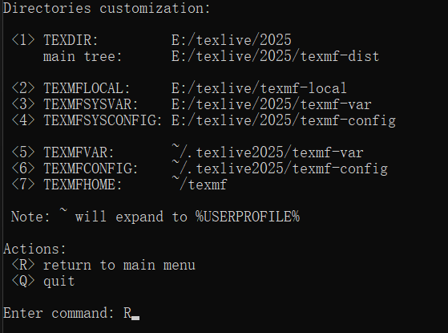
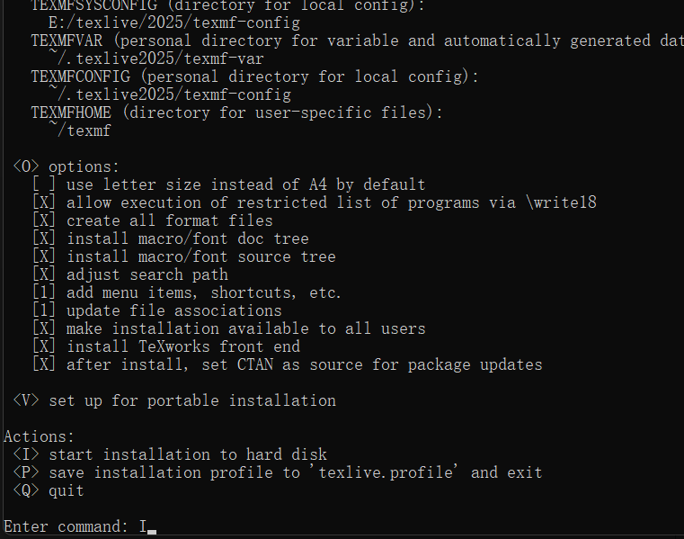
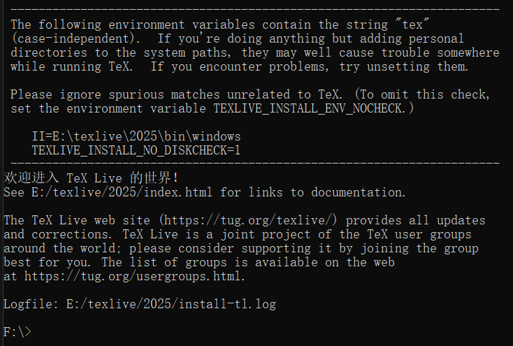

# 解决安装Tex Live卡在卡在running package-specific postactions

卡在 running package-specific postactions 主要是gui的问题

### 1 下载
官方镜像
http://mirror.ctan.org/systems/texlive/Images/texlive2025.iso
下载速度慢，采用国内镜像
清华大学（北京）：https://mirrors.tuna.tsinghua.edu.cn/CTAN/systems/texlive/Images/texlive2025.iso
上海交通大学（上海）：https://mirrors.sjtug.sjtu.edu.cn/ctan/systems/texlive/Images/texlive2025.iso

### 2 Windows下的 no gui 安装过程
下载的镜像如图


右键，把镜像装载如下


点击打开


记住装载路径


以管理员的身份启动终端命令


进入装载盘
```bash
F:
```


查看目录
```bash
dir
```


启动 no gui 安装
```bash
install-tl-windows.bat --no-gui
```



输入D改变安装路径


选择1，然后更改路径例如
```bash
E:/texlive/2025
```


输入R返回


然后输入I进行安装


安装成功


